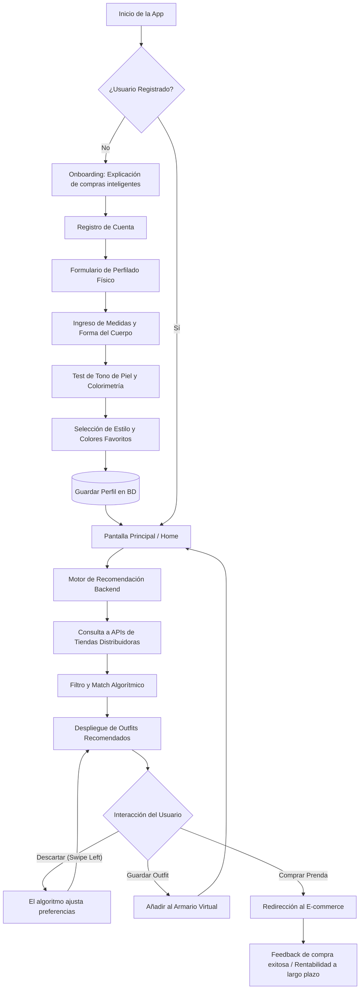

<div align="center">

# 👗 StyleSync

**Revolucionando la experiencia de compra de vestuario con colorimetría y consumo inteligente**

Transforma tus datos físicos, preferencias y colorimetría en atuendos perfectos que fortalecen tu seguridad, conectados directamente al inventario de tus tiendas favoritas.

[](https://reactnative.dev/)
[](https://expo.dev/)
[](https://nodejs.org/)
[](https://zustand-demo.pmnd.rs/)

[Explorar Documentación](./docs/README.md) · [Arquitectura](./docs/arquitectura.md) · [Algoritmo de Colorimetría](./docs/algoritmo.md)

</div>

---

## 🧭 ¿Qué es StyleSync?

> **El problema:** [En replantimiento!]
>
> **La solución StyleSync:** Un sistema que analiza las medidas, tono de piel y gustos del usuario para cruzar esta información con el catálogo real de grandes distribuidoras. La app recomienda únicamente atuendos (outfits) de alta compatibilidad, garantizando una compra rentable y un aumento en la confianza personal.

---

## 👥 Equipo y Roles

| Miembro | Rol Principal | Responsabilidades |
| :--- | :--- | :--- |
| **Francisco Carvajal** | Diseñador UI/UX & Frontend | Diseño principal, creación de interfaces y programación de la capa visual. |
| **Gerzon Toro** | Desarrollador Frontend | Implementación de código, lógica de componentes y funcionalidades del cliente. |
| **Francisco Carrera** | Full-Stack Developer | Desarrollo integral de frontend y construcción futura de la arquitectura del backend. |

---

## 🛠 Arquitectura y Stack Tecnológico

| Capa | Tecnologías | Descripción |
| :--- | :--- | :--- |
| **Frontend (Presentación)** | React Native, Expo, NativeWind, Zustand | Arquitectura *Feature-Driven* para compilar en web y móvil compartiendo código. |
| **Backend (Negocio y BD)** | *[Por Definir / En Investigación]* | Capa en fase de investigación. Las tecnologías para la API, base de datos y algoritmo de recomendación se definirán en futuras etapas. |

---

## 📂 Estructura del Código

El proyecto está organizado en módulos para separar claramente la interfaz, la lógica de negocio y la documentación técnica:

```text
stylesync/
├── docs/                        # 📚 Documentación técnica completa
│   ├── 01-producto/             # Visión, problema, y objetivos
│   ├── 02-arquitectura/         # Diagramas de arquitectura y decisiones
│   └── 03-algoritmo/            # Lógica matemática de colorimetría y matches
│
├── src/                         # 📱 Capa Cliente (React Native + Expo)
│   ├── app/                     # Enrutamiento (Expo Router) y navegación base
│   ├── features/                # Módulos desacoplados por dominio de negocio
│   │   ├── auth/                # Registro y perfil de usuario
│   │   ├── metrics/             # Formulario de medidas y test de colorimetría
│   │   ├── wardrobe/            # Armario virtual e historial de compras
│   │   └── recommendations/     # Motor de visualización de outfits sugeridos
│   ├── shared/                  # Componentes UI (Botones, Tarjetas), utilidades y tipos
│   └── services/                # Conexión futura a la API (Axios/TanStack Query)
│
└── backend/                     # ⚡ Capa Servidor (Node.js / En investigación)
    ├── api/                     # Futuros endpoints del sistema
    └── database/                # Esquemas y migraciones de la base de datos
```

---

## 📚 Mapa de la Documentación

Toda la documentación del proyecto se encuentra estructurada en la carpeta `/docs` para facilitar la lectura por parte de los profesores y evaluadores:

| Módulo | Contenido Principal | Propósito en la Evaluación |
| :--- | :--- | :--- |
| **01. Producto** | Visión general, definición del problema y alcance de la aplicación. | Justificar la viabilidad comercial y el impacto en el usuario. |
| **02. Arquitectura** | Stack tecnológico detallado, patrones de diseño (*Feature-Driven*) y diagramas UML. | Demostrar el dominio de los conceptos de Arquitectura de Desarrollo. |
| **03. Algoritmo** | Reglas de negocio para cruzar medidas corporales y tonos con catálogos de ropa. | Explicar el "cerebro" detrás de las recomendaciones inteligentes. |

---

## 🔄 Diagrama de Flujo Base (User Journey)

El siguiente diagrama detalla el recorrido del usuario desde que abre la aplicación hasta que interactúa con las prendas sugeridas por el sistema.

