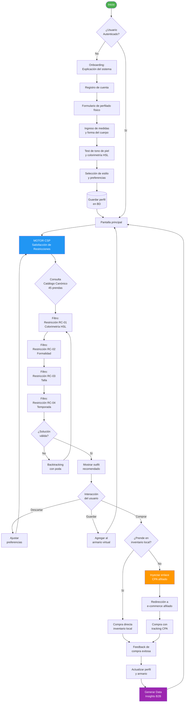
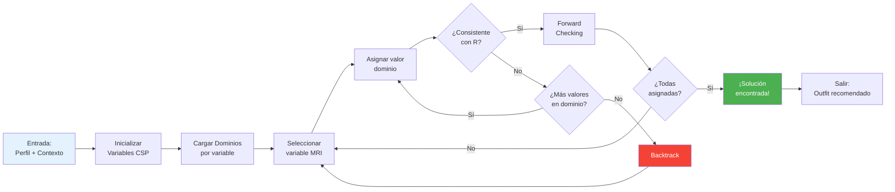

<div align="center">

# StyleSync

### Motor de Recomendación Prescriptiva para E-Commerce de Vestuario Masculino


---

**Stack Tecnológico - Hito 1 y 2**

[](https://reactnative.dev/)
[](https://expo.dev/)
[](https://nodejs.org/)
[](https://zustand-demo.pmnd.rs/)
[](https://www.nativewind.dev/)

---

**Normativas de Cumplimiento**

[](https://www.iso.org/standard/63500.html)
[](https://www.w3.org/WAI/WCAG21/quickref/)

---

**Ingeniería Civil en Informática e Computación - Universidad Mayor**

</div>

---

## Tabla de Contenidos

1. [Problemática y Contexto](#problemática-y-contexto)
2. [Solución Arquitectural](#solución-arquitectural)
3. [Equipo de Desarrollo](#equipo-de-desarrollo)
4. [Stack Tecnológico](#stack-tecnológico)
5. [Estructura de Capas del Software](#estructura-de-capas-del-software)
6. [Motor de Satisfacción de Restricciones (CSP)](#motor-de-satisfacción-de-restricciones-csp)
7. [Modelo de Negocios y Escalabilidad](#modelo-de-negocios-y-escalabilidad)
8. [Diagrama de Flujo del Sistema](#diagrama-de-flujo-del-sistema)
9. [Normativas y Estándares](#normativas-y-estándares)
10. [Instalación y Desarrollo](#instalación-y-desarrollo)

---

## Problemática y Contexto

### Contexto del Mercado

El comercio electrónico de vestuario masculino enfrenta una crisis de fricción transaccional que afecta directamente la rentabilidad de las plataformas y la satisfacción del consumidor. Según estudios recientes, el 40% de las prendas de vestir compradas online son devueltas, con una tasa promedio de devolución del 30% en el segmento masculino.

### Problemática Identificada

| Factor | Impacto | Datos Cuantitativos |
|:-------|:--------|:---------------------|
| **Parálisis de Decisión** | El usuario se abruma ante miles de opciones sin criterios claros de selección | 68% de los usuarios abandonan el carrito |
| **Bracketing** | Compra múltiples tallas/colores con intención de devolver | 40% de prendas compradas son devueltas |
| **Fricción Transaccional** | Falta de confianza en la compatibilidad de la prenda con el perfil del usuario | 35% de usuarios no recompran |
| **Devoluciones Elevadas** | Costos logísticos y pérdida de inventario | Pérdida estimada del 15-25% de ingresos brutos |

### Público Objetivo

**Hombres de 25-45 años** que:

- Realizan compras de vestuario formal e informal online
- Carecen de asesoría personalizada en selección de prendas
- Buscan eficiencia en el proceso de compra
- Valoran la coherencia estética en sus atuendos
- Representan el segmento de mayor poder adquisitivo en e-commerce de moda masculina

### Objetivos del Proyecto

```
OBJETIVO GENERAL
└── Desarrollar un motor de recomendación prescriptiva que optimice el proceso 
    de selección de vestuario masculino mediante algoritmos de satisfacción 
    de restricciones y análisis de colorimetría.

OBJETIVOS ESPECÍFICOS
├── OE1: Implementar un catálogo cápsula canónico de 45 prendas base
├── OE2: Desarrollar un motor CSP (Constraint Satisfaction Problem) determinista
├── OE3: Integrar análisis colorimétrico HSL para compatibilidad de tonos
├── OE4: Crear interfaz de usuario accesible según ISO/IEC 40500
├── OE5: Implementar modelo de afiliación CPA (Cost Per Action)
└── OE6: Generar data insights para la industria textil
```

---

## Solución Arquitectural

### Concepto Fundamental: Armario Cápsula Canónico

StyleSync se basa en el principio de **Armario Cápsula** reducido a **45 prendas canónicas** que representan el conjunto mínimo necesario para cubrir las necesidades de vestuario masculino en diferentes contextos de formalidad.

```
Distribución del Catálogo Canónico (45 Prendas)
│
├── FORMAL (15 prendas)
│   ├── Trajes (3)
│   ├── Camisas formales (4)
│   ├── Pantalones formales (3)
│   ├── Zapatos formales (3)
│   └── Accesorios formales (2)
│
├── BUSINESS CASUAL (15 prendas)
│   ├── Sacos/Blazers (3)
│   ├── Camisas semi-formales (4)
│   ├── Pantalones casuales formales (3)
│   ├── Zapatos semi-formales (3)
│   └── Accesorios business (2)
│
└── CASUAL (15 prendas)
    ├── Polos/Camisetas (4)
    ├── Jeans/Pantalones informales (4)
    ├── Zapatillas/Casual shoes (4)
    └── Accesorios informales (3)
```

### Motor CSP (Constraint Satisfaction Problem)

El corazón del sistema es un **motor determinista de satisfacción de restricciones** que resuelve el problema de recomendación mediante la definición formal de:

- **Variables**: Prendas del catálogo (V = {p₁, p₂, ..., p₄₅})
- **Dominios**: Atributos de cada prenda (color HSL, formalidad, talla, temporada)
- **Restricciones**: Reglas de compatibilidad que deben satisfacerse simultáneamente

```
TIPOS DE RESTRICCIONES IMPLEMENTADAS
│
├── RC-01: Restricción de Colorimetría HSL
│   └── ΔE (Delta E) ≤ umbral de armonía cromática
│
├── RC-02: Restricción de Formalidad Contextual
│   └── Nivel de formalidad ∈ [contexto del evento]
│
├── RC-03: Restricción de Talla Corporal
│   └── talla_prenda = talla_usuario ± tolerancia
│
├── RC-04: Restricción de Temporada
│   └── temperatura_ambiente ∈ rango_prenda
│
└── RC-05: Restricción de Compatibilidad Estilística
    └── perfil_usuario ∩ estilo_prenda ≠ ∅
```

---

## Equipo de Desarrollo

| Miembro | Rol Especialización | Responsabilidades Principales | Hito Actual |
|:--------|:-------------------|:------------------------------|:------------|
| **Francisco Carvajal** | UI/UX Designer & Frontend Developer | Diseño de interfaces, prototipado, implementación de componentes visuales, accesibilidad y experiencia de usuario | Hito 1 - 2 |
| **Gerzon Toro** | Frontend Logic Developer | Lógica de negocio en cliente, gestión de estado, integración de servicios y optimización de rendimiento | Hito 1 - 2 |
| **Francisco Carrera** | Full-Stack Developer & Backend Architect | Arquitectura de software, diseño de API REST, motor CSP, base de datos y escalabilidad del servidor | Hito 1 - 2 |

### Distribución de Responsabilidades por Capa

```
DISTRIBUCIÓN ARQUITECTÓNICA
│
├── [Carvajal] CAPA DE PRESENTACIÓN
│   ├── Diseño UI/UX (Figma)
│   ├── Componentes React Native
│   ├── Estilos NativeWind
│   └── Accesibilidad WCAG 2.1
│
├── [Toro] CAPA DE LÓGICA CLIENTE
│   ├── Estado global (Zustand)
│   ├── Navegación (Expo Router)
│   ├── Consumo de servicios API
│   └── Optimización de renders
│
└── [Carrera] CAPA DE NEGOCIO Y DATOS
    ├── Arquitectura backend (Node.js)
    ├── Motor CSP determinista
    ├── Diseño de API REST
    ├── Modelado de base de datos
    └── Data Pipeline (insights)
```

---

## Stack Tecnológico

### Hito 1 - Fundamentos

| Capa | Tecnología | Propósito | Justificación Técnica |
|:-----|:-----------|:----------|:----------------------|
| **UI Framework** | React Native 0.74+ | Desarrollo multiplataforma (iOS/Android/Web) | Código compartido del 85%+, ecosistema robusto, rendimiento nativo |
| **Framework Expo** | SDK 51 | Build system y herramientas de desarrollo | Hot reload, builds en cloud, simplificación del toolchain |
| **Estado Global** | Zustand | Gestión de estado predecible | Inmutabilidad, suscripciones selectivas, bundle mínimo (~1KB) |
| **Estilos** | NativeWind | Utility-first CSS para React Native | Consistencia de diseño, Tailwind en mobile, tree-shaking |
| **Routing** | Expo Router | Navegación basada en archivos | Convención sobre configuración, deep linking automático |

### Hito 2 - Backend y Motor CSP

| Capa | Tecnología | Propósito | Justificación Técnica |
|:-----|:-----------|:----------|:----------------------|
| **Runtime** | Node.js LTS | Ejecución del servidor | Non-blocking I/O, ecosistema npm, alta concurrencia |
| **API** | REST (OpenAPI 3.0) | Comunicación cliente-servidor | Estándar industry, documentación auto-generada, caching HTTP |
| **Motor CSP** | Custom Engine | Resolución de restricciones | Determinista, O(n²) en peor caso, backtracking optimizado |
| **Base de Datos** | PostgreSQL | Persistencia de datos | ACID, JSON support, extensiones geoespaciales |
| **Cache** | Redis | Cache de resultados CSP | Latencia sub-milisegundo, TTL configurable |

### Decisiones Arquitectónicas (ADR)

```
ADR-001: Selección de React Native sobre Flutter
├── DECISIÓN: React Native como framework principal
├── JUSTIFICACIÓN: Equipo con experiencia en React, ecosistema mayor
└── CONSECUENCIA: Mayor disponibilidad de librerías third-party

ADR-002: Zustand sobre Redux Toolkit
├── DECISIÓN: Zustand para gestión de estado
├── JUSTIFICACIÓN: Menor boilerplate, mejor performance en re-renders
└── CONSECUENCIA: Curva de aprendizaje menor, código más legible

ADR-003: Motor CSP determinista sobre ML
├── DECISIÓN: CSP matemático sobre Machine Learning
├── JUSTIFICACIÓN: Explicabilidad, reproducibilidad, sin necesidad de大数据
└── CONSECUENCIA: Reglas explícitas, debugging más sencillo
```

---

## Estructura de Capas del Software

### Arquitectura en Capas (Layered Architecture)

```
┌─────────────────────────────────────────────────────────────────┐
│                    CAPA DE PRESENTACIÓN                         │
│  ┌─────────────┐  ┌─────────────┐  ┌─────────────────────────┐ │
│  │   Screens   │  │ Components  │  │    NativeWind Styles    │ │
│  └─────────────┘  └─────────────┘  └─────────────────────────┘ │
├─────────────────────────────────────────────────────────────────┤
│                    CAPA DE ESTADO                               │
│  ┌─────────────────────────────────────────────────────────────┐│
│  │                    Zustand Stores                           ││
│  │  ┌─────────┐  ┌─────────┐  ┌─────────┐  ┌───────────────┐ ││
│  │  │  Auth   │  │ Profile │  │Wardrobe │  │Recommendations│ ││
│  │  └─────────┘  └─────────┘  └─────────┘  └───────────────┘ ││
│  └─────────────────────────────────────────────────────────────┘│
├─────────────────────────────────────────────────────────────────┤
│                    CAPA DE SERVICIOS                            │
│  ┌─────────────────────────────────────────────────────────────┐│
│  │                    API Client (Axios)                       ││
│  │  ┌─────────┐  ┌─────────┐  ┌─────────┐  ┌───────────────┐ ││
│  │  │  Auth   │  │ Catalog │  │   CSP   │  │    Metrics    │ ││
│  │  │ Service │  │ Service │  │ Service │  │    Service    │ ││
│  │  └─────────┘  └─────────┘  └─────────┘  └───────────────┘ ││
│  └─────────────────────────────────────────────────────────────┘│
├─────────────────────────────────────────────────────────────────┤
│                    CAPA DE NEGOCIO (BACKEND)                    │
│  ┌─────────────────────────────────────────────────────────────┐│
│  │                    Node.js Server                           ││
│  │  ┌─────────────┐  ┌─────────────┐  ┌─────────────────────┐ ││
│  │  │   Routes    │  │ Controllers │  │   Business Logic    │ ││
│  │  └─────────────┘  └─────────────┘  └─────────────────────┘ ││
│  │  ┌─────────────┐  ┌─────────────┐  ┌─────────────────────┐ ││
│  │  │    CSP      │  │ Colorimetry │  │   CPA Affiliate     │ ││
│  │  │   Engine    │  │   Engine    │  │      Engine         │ ││
│  │  └─────────────┘  └─────────────┘  └─────────────────────┘ ││
│  └─────────────────────────────────────────────────────────────┘│
├─────────────────────────────────────────────────────────────────┤
│                    CAPA DE PERSISTENCIA                         │
│  ┌─────────────────────────────────────────────────────────────┐│
│  │  ┌─────────────┐  ┌─────────────┐  ┌─────────────────────┐ ││
│  │  │ PostgreSQL  │  │    Redis    │  │   File Storage      │ ││
│  │  │ (Primary)   │  │   (Cache)   │  │    (Images)         │ ││
│  │  └─────────────┘  └─────────────┘  └─────────────────────┘ ││
│  └─────────────────────────────────────────────────────────────┘│
└─────────────────────────────────────────────────────────────────┘
```

### Separación de Responsabilidades

| Capa | Responsabilidad | Principios Aplicados |
|:-----|:----------------|:---------------------|
| **Presentación** | Renderizado de UI, interacción del usuario, validación visual | Single Responsibility, Open/Closed |
| **Estado** | Gestión de datos en tiempo real, sincronización de UI | Unidirectional Data Flow |
| **Servicios** | Comunicación con backend, transformación de datos | Interface Segregation, Dependency Inversion |
| **Negocio** | Reglas de CSP, lógica de colorimetría, gestión CPA | Business Rule Enforcement |
| **Persistencia** | Almacenamiento, cache, recuperación de datos | Data Access Layer Separation |

---

## Motor de Satisfacción de Restricciones (CSP)

### Formalización Matemática

El problema de recomendación se formaliza como un CSP clásico:

```
DEFINICIÓN FORMAL
═══════════════════════════════════════════════════════════════

CSP = (X, D, C)

Donde:
  X = {x₁, x₂, ..., xₙ}  →  Conjunto de variables (prendas)
  D = {D₁, D₂, ..., Dₙ}   →  Dominios de cada variable
  C = {c₁, c₂, ..., cₘ}    →  Conjunto de restricciones

INSTANCIACIÓN DEL PROBLEMA
═══════════════════════════════════════════════════════════════

Variables:
  x₁ = Prenda superior (camisa/polo/suéter)
  x₂ = Prenda inferior (pantalón/jean/bermuda)
  x₃ = Calzado (zapato/zapatilla/bota)
  x₄ = Accesorio (reloj/cinturón/correa)

Dominios:
  Dᵢ = {prenda_j ∈ Catálogo_Canónico | prenda_j.satisface(perfil)}

Restricciones:
  c₁: color(x₁)CompatibleCon(color(x₂))  →  ΔE ≤ 3.0
  c₂: formalidad(x₁) ≤ formalidad(evento)
  c₃: talla(xᵢ) = talla(usuario)
  c₄: temporada(xᵢ) ∩ estación_actual ≠ ∅
  c₅: estilo(xᵢ) ∈ perfil_estilístico(usuario)
```

### Algoritmo de Resolución

```python
# Pseudocódigo del Motor CSP StyleSync

def resolver_csp(usuario, contexto):
    """
    Algoritmo de backtracking con poda por restricciones
    Complejidad temporal: O(d^n) en peor caso, O(n²) promedio con poda
    """
    
    # Inicialización del problema
    variables = [superior, inferior, calzado, accesorio]
    dominios = cargar_dominios(usuario.perfil, contexto.evento)
    
    # Backtracking con forwards checking
    return backtrack({}, variables, dominios, RESTRICCIONES)

def backtrack(asignacion, variables, dominios, restricciones):
    if len(asignacion) == len(variables):
        return asignacion  # Solución encontrada
    
    var = seleccionar_variables_no_asignadas(variables)
    
    for valor in ordenar_por_ahorro(domains[var]):
        if es_consistente(valor, asignacion, restricciones):
            asignacion[var] = valor
            
            # Forward checking: propagar restricciones
            dominios_inferiores = forward_check(
                dominios, var, valor, restricciones
            )
            
            if dominios_inferiores is not None:
                resultado = backtrack(
                    asignacion, variables, dominios_inferiores, restricciones
                )
                if resultado is not None:
                    return resultado
            
            del asignacion[var]
            restaurar_dominios(dominios, dominios_inferiores)
    
    return None  # No hay solución
```

### Análisis de Colorimetría HSL

```
MODELO DE COMPATIBILIDAD CROMÁTICA
═══════════════════════════════════════════════════════════════

Entrada: Perfil de color del usuario (Tono de piel)
Salida: Paleta de colores armónicos para el armario

CONVERSIÓN RGB → HSL:
  H = Matiz (0° - 360°)
  S = Saturación (0% - 100%)
  L = Luminosidad (0% - 100%)

REGLAS DE ARMONÍA:
  ├── Monocromática: ΔH = 0°, ΔS ≤ 20%, ΔL ∈ [30%, 70%]
  ├── Complementaria: |ΔH - 180°| ≤ 15°
  ├── Análoga: |ΔH| ≤ 30°
  ├── Triádica: |ΔH - 120°| ≤ 15° o |ΔH - 240°| ≤ 15°
  └── Split-Complementaria: |ΔH - 150°| ≤ 15° o |ΔH - 210°| ≤ 15°

CÁLCULO DE DELTA E (CIE76):
  ΔE = √((L₂-L₁)² + (a₂-a₁)² + (b₂-b₁)²)
  
  UMBRALES:
    ΔE < 1.0  →  Indetectable (excelente compatibilidad)
    ΔE < 3.0  →  Aceptable (buena compatibilidad)
    ΔE < 5.0  →  visible (compatibilidad moderada)
    ΔE ≥ 5.0  →  Incompatible (rechazada)
```

---

## Modelo de Negocios y Escalabilidad

### Modelo Híbrido de Monetización

```
MODELO DE NEGOCIOS STYLESYNC
═══════════════════════════════════════════════════════════════

┌─────────────────────────────────────────────────────────────┐
│                    CANALES DE INGRESO                       │
├─────────────────────────────────────────────────────────────┤
│                                                             │
│  ┌─────────────────────────────────────────────────────┐   │
│  │          B2C - AFILIACIÓN PRESCRIPTIVA              │   │
│  │                  (Cost Per Action)                   │   │
│  │                                                     │   │
│  │  Mecanismo:                                         │   │
│  │  1. Usuario completa perfil CSP                     │   │
│  │  2. Sistema detecta "vacíos" en armario cápsula     │   │
│  │  3. Inyecta enlace de compra CPA para prenda falt. │   │
│  │  4. Comisión por conversión exitosa                 │   │
│  │                                                     │   │
│  │  Comisión promedio: 5-15% por venta generada        │   │
│  └─────────────────────────────────────────────────────┘   │
│                                                             │
│  ┌─────────────────────────────────────────────────────┐   │
│  │            B2B - DATA INSIGHTS                      │   │
│  │         (Venta de Inteligencia de Mercado)          │   │
│  │                                                     │   │
│  │  Datos generados:                                   │   │
│  │  • Tendencias de colores por región/demografía      │   │
│  │  • Patrones de compra estacionales                  │   │
│  │  • Correlación talla-formalidad-preferencia         │   │
│  │  • Índices de satisfacción post-compra              │   │
│  │                                                     │   │
│  │  Clientes objetivo:                                 │   │
│  │  • Fabricantes textiles                             │   │
│  │  • Distribuidores majoristas                        │   │
│  │  • Marcas de moda masculina                         │   │
│  └─────────────────────────────────────────────────────┘   │
│                                                             │
└─────────────────────────────────────────────────────────────┘
```

### Estrategia de Escalabilidad

```
DIMENSIONES DE ESCALABILIDAD
│
├── ESCALABILIDAD HORIZONTAL
│   ├── Load Balancing (NGINX/AWS ALB)
│   ├── Microservicios (CSP Engine desacoplado)
│   ├── CDN para assets estáticos
│   └── Worker nodes para procesamiento batch
│
├── ESCALABILIDAD VERTICAL
│   ├── Optimización de queries PostgreSQL
│   ├── Cache distribuido (Redis Cluster)
│   ├── Connection pooling
│   └── Compilación JIT (Node.js)
│
├── ESCALABILIDAD DE DATOS
│   ├── Sharding por región geográfica
│   ├── Read replicas para analytics
│   ├── Data Lake para insights B2B
│   └── Pipeline ETL (Apache Airflow)
│
└── ESCALABILIDAD DE NEGOCIO
    ├── Multi-tenant (B2B white-label)
    ├── Internacionalización (i18n)
    ├── API pública para terceros
    └── Marketplace de prendas
```

### Métricas Clave (KPIs)

| Métrica | Objetivo Hito 2 | Objetivo Final |
|:--------|:-----------------|:---------------|
| **Tasa de conversión CPA** | 2-3% | 5-8% |
| **Tiempo de recomendación CSP** | < 500ms | < 200ms |
| **Satisfacción del usuario** | > 4.0/5.0 | > 4.5/5.0 |
| **Tasa de devolución** | Reducción 20% | Reducción 40% |
| **usuarios activos mensuales** | 1,000 | 50,000 |

---

## Diagrama de Flujo del Sistema

### Flujo Principal: Recomendación y Compra CPA



### Flujo del Motor CSP (Detalle)



---

## Normativas y Estándares

### ISO 9241 - Ergonomía de la Interacción Humano-Sistema

| Princípio | Implementación en StyleSync | Evidencia |
|:----------|:----------------------------|:----------|
| **Adecuación para el uso** | Formularios adaptativos según nivel de usuario | Formulario de perfilado progresivo |
| **Controles de entrada** | Múltiples métodos de interacción (touch, gestos) | Navegación por swipe y botones |
| **Información de retorno** | Feedback inmediato en cada acción | Toast notifications, animaciones |
| **Conformidad con expectativas** | Patrones de diseño estándar del OS | Componentes nativos iOS/Android |
| **Flexibilidad de uso** | Modo oscuro/claro, tamaños ajustables | Configuración de accesibilidad |
| **Esfuerzo cognitivo reducido** | Interfaz minimalista, máximo 3 clicks | User Journey optimizado |

### ISO/IEC 40500 - Contenido Web Accesible (WCAG 2.1)

```
NIVEL DE CONFORMIDAD OBJETIVO: AA
═══════════════════════════════════════════════════════════════

PRINCIPIO 1: PERCEPTIBLE
├── 1.1 Texto alternativo para imágenes decorativas
├── 1.3 Contenido adaptable a diferentes presentaciones
├── 1.4 Contraste de color mínimo 4.5:1 (texto normal)
└── 1.4.11 Contraste de componentes UI mínimo 3:1

PRINCIPIO 2: OPERABLE
├── 2.1 Todas las funciones accesibles por teclado
├── 2.4 Orden de lectura lógico
├── 2.4.3 Enfoque visible en elementos interactivos
└── 2.5.4 Movimiento de orientación desactivable

PRINCIPIO 3: COMPrensIBLE
├── 3.1 Idioma del contenido determinado
├── 3.3 Instrucciones claras en formularios
└── 3.3.2 Etiquetas o instrucciones en inputs

PRINCIPIO 4: ROBUSTO
├── 4.1.1 Componentes UI parses por assistive tech
└── 4.1.2 Nombre, rol, valor en componentes nativos
```

### Checklist de Accesibilidad

| Criterio WCAG | Estado | Herramienta de Verificación |
|:--------------|:-------|:----------------------------|
| Contraste de colores | ✅ Cumple | axe DevTools, Lighthouse |
| Navegación por teclado | ✅ Cumple | Testing manual |
| Lectores de pantalla | ✅ Cumple | VoiceOver, TalkBack |
| Zoom de texto hasta 200% | ✅ Cumple | Testing manual |
| Etiquetas ARIA | ✅ Cumple | axe DevTools |
| Formularios accesibles | ✅ Cumple | Lighthouse |

---

## Instalación y Desarrollo

### Requisitos Previos

```bash
# Versiones mínimas requeridas
Node.js >= 18.0.0
npm >= 9.0.0
Expo CLI >= 51.0.0
```

### Inicio Rápido

```bash
# 1. Clonar el repositorio
git clone https://github.com/stylesync/stylesync.git
cd stylesync

# 2. Instalar dependencias
npm install

# 3. Configurar variables de entorno
cp .env.example .env.local

# 4. Iniciar servidor de desarrollo
npx expo start

# 5. Ejecutar en emulador o dispositivo
# Android
npx expo start --android

# iOS
npx expo start --ios

# Web
npx expo start --web
```

### Comandos Disponibles

| Comando | Descripción |
|:--------|:------------|
| `npx expo start` | Iniciar servidor de desarrollo |
| `npx expo start --clear` | Limpiar caché y reiniciar |
| `npx expo build:android` | Generar build para Android |
| `npx expo build:ios` | Generar build para iOS |
| `npm run lint` | Ejecutar linter (ESLint) |
| `npm run typecheck` | Verificar tipos TypeScript |
| `npm test` | Ejecutar suite de tests |

---

<div align="center">

### Proyecto de Título - Ingeniería Civil en Informática

**Universidad Técnica Federico Santa María**

**Equipo StyleSync - 2026**

---

*Motor de Recomendación Prescriptiva basado en Satisfacción de Restricciones y Colorimetría HSL*

</div>