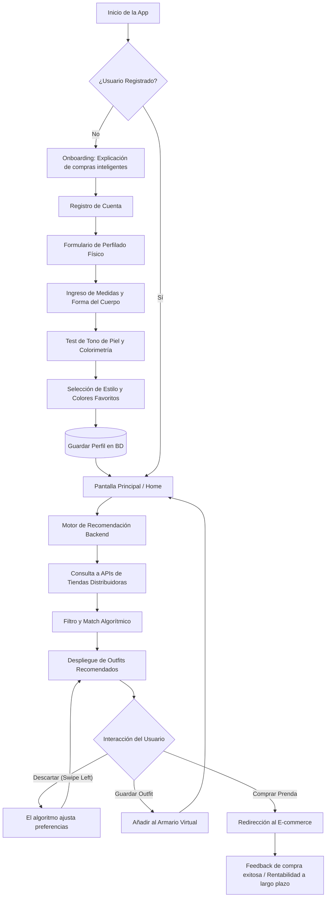

# [StyleSync]

Aplicación móvil y web orientada a revolucionar la experiencia de compra de vestuario. Mediante el análisis de datos físicos, colorimetría y preferencias personales, el sistema recomienda atuendos que fortalecen la seguridad del usuario. La plataforma se conecta directamente con inventarios de grandes tiendas para promover un consumo inteligente, asegurando que cada compra sea rentable y no acumule polvo en el armario. Proyecto de Arquitectura de Desarrollo.

## 👥 Equipo y Roles

| Miembro | Rol Principal | Responsabilidades |
| :--- | :--- | :--- |
| **Francisco Carvajal** | Diseñador UI/UX & Frontend | Diseño principal, creación de interfaces y programación de la capa visual. |
| **Gerzon Toro** | Desarrollador Frontend | Implementación de código, lógica de componentes y funcionalidades del cliente. |
| **Francisco Carrera** | Full-Stack Developer | Desarrollo integral de frontend y construcción futura de la arquitectura del backend. |

## 🛠 Arquitectura y Stack Tecnológico

| Capa | Tecnologías | Descripción |
| :--- | :--- | :--- |
| **Frontend (Presentación)** | React Native, Expo, NativeWind, Zustand | Arquitectura *Feature-Driven* para compilar en web y móvil compartiendo código. |
| **Backend (Negocio y BD)** | *[Por Definir / En Investigación]* | Capa en fase de investigación. Las tecnologías para la API, base de datos y algoritmo de recomendación se definirán en futuras etapas. |

## 📅 Fases de Construcción

| Fase | Etapa | Objetivos Principales |
| :--- | :--- | :--- |
| **Fase 1** | Diseño e Infraestructura | Definición de la línea gráfica, wireframes de la UI y configuración del repositorio base multiplataforma. |
| **Fase 2** | Desarrollo Frontend | Construcción de componentes modulares, ruteo de pantallas e integración del formulario de métricas. |
| **Fase 3** | Algoritmo y Base de Datos | *[En investigación]* Definición y programación del motor de reglas para cruzar medidas corporales y colorimetría. |
| **Fase 4** | Integración E-commerce | *[En investigación]* Conexión del frontend con el futuro servidor, despliegue de catálogos y depuración del ciclo de compra. |

## 🔄 Diagrama de Flujo Base (User Journey)

El siguiente diagrama detalla el recorrido del usuario desde que abre la aplicación hasta que interactúa con las prendas sugeridas. GitHub renderizará este bloque automáticamente como un diagrama visual.

